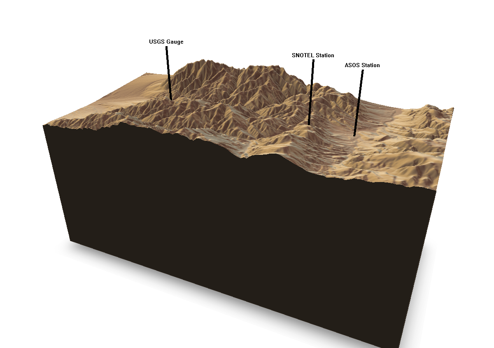

```{r setup, echo = TRUE, eval = TRUE, warning = FALSE, error = FALSE, message = FALSE}
knitr::opts_chunk$set(echo = TRUE, eval = TRUE, warning = FALSE, error = FALSE, message = FALSE)
library(USAboundaries)
library(sf)
library(elevatr)
library(tmap)
library(raster)
library(rayshader)
library(geoviz)
# library(magick) req for GIF
# library(gifski)
# library(rlang)
# library(rgl)
library(leaflet)
library(imputeTS)
library(snotelr)
library(tidyverse)
library(ggplot2)
library(ggradar)
library(lubridate)
library(RNRCS)
library(riem)
library(dataRetrieval)
library(rnoaa)
library(metScanR)
library(xts)
library(scales)
library(windrose)
library(solaR)


```

# Introduction

This analysis completes homework sets 1-4 for Dr. Steven Fassnacht's WR574 Snow Hydrology Class at Colorado State University (plus a little extra flair!)

## Data Read-In

Read in data programmatically for ASOS, SNOTEL, and USGS Gauging Stations near Taos, New Mexico for Water Year 2019
```{r Programmatically read in the data}

# Call SNOTEL data for Palo site near Taos NM 
snotel <- grabNRCS.data(network = "SNTL", 
                           site = "1170", 
                           timescale = "hourly", 
                           DayBgn = "2018-09-01", 
                           DayEnd = "2019-08-31")

# Call ASOS data for Angelfire, NM airport
nm_asos_stations <- riem_stations(network = "NM_ASOS")


asos <- riem_measures(station = "AXX", 
                              date_start = "2018-09-01", 
                              date_end = "2019-08-31")

# Call USGS stream gauge daily data from Rio Pueblo
stream <- readNWISdv("08269000",
                 parameterCd = '00060',
                 startDate = '2018-09-01',
                 endDate = '2019-08-31') %>%
  rename(q_cfs = X_00060_00003,
         q_cd = X_00060_00003_cd) %>%
  filter(q_cfs > 0)


```


## Data Management

Manipulate the raw data into more friendly forms for data science

Breaking out a single datetime column into year, month, day, and hour, minute second (where appropriate)

```{r Break out the dates columns}

# SNOTEL Data
snotel_datebreak <- snotel %>%
  mutate(date = ymd_hm(Date),
         year=year(date),
         month=month(date),
         day=day(date),
         hour=hour(date))

# STREAM Data
stream_datebreak <- stream %>%
  mutate(date = ymd(Date),
      year=year(date),
      month=month(date),
      day=day(date))

# ASOS Data
asos_datebreak <- asos %>%
  mutate(date = ymd_hms(valid),
      year=year(date),
      month=month(date),
      day=day(date),
      hour=hour(date),
      minute=minute(date))


```

# Spatial Look

## Digital Elevation Model: Taos County and stations used in analysis

```{r Spatial Look, eval = TRUE}
station_meta = read_csv("Data/station_meta.csv")

usa <- us_states()

nm_shape <- usa %>%
  filter(stusps == 'NM')

taos_county <- us_counties() %>%
  filter(name == "Taos")

sf_nm_stations <- station_meta %>%
  st_as_sf(coords=c('long','lat'),crs=4326)

nm_elev <- elevatr::get_elev_raster(nm_shape, z=8)


taos_county_elev <- elevatr::get_elev_raster(taos_county, z=10)

tm_shape(taos_county) + 
  tm_polygons() + 
  tm_shape(taos_county_elev) +
  tm_raster(style='cont',palette = 'Purples') + 
  tm_shape(sf_nm_stations) + 
  tm_dots(col='station_type',size=2,palette=c('red','white', "blue"))+
  tm_scale_bar() +
  tm_compass()

#save to file then eval = false
```

- ASOS (automated surface observation station) at Angelfire, NM airport 

- SNOTEL (snow telemetry) station Palo

- USGS stream gauge Rio Pueblo de Taos (ID: 8269000) used in this analysis for snow modelling. Stations are located in northern New Mexico in Taos County

```{r Spatial Look - 3d Slice, echo = FALSE, eval = FALSE}

#small_taos <- aggregate(taos_county, fact = 6)

# nm_stations_m <- st_transform(sf_nm_stations, crs = 2163)
# 
# sites_20km_buff <- st_buffer(nm_stations_m, dist = 30000)
# 
# sites_buff_raster <- st_transform(sites_20km_buff, crs = 4326)
# 
# sites_crop <- crop(nm_elev, sites_buff_raster)
# 
# sites_elev_raster <- elevatr::get_elev_raster(sites_crop, z = 12) #this one can be used in matrix function to create high res 3d plot
# 
# sites_matrix <- matrix(raster::extract(sites_crop,
#                       raster::extent(sites_crop), buffer = 100),
#                       nrow = ncol(sites_crop), ncol = nrow(sites_crop))

# sites_matrix %>%
#   sphere_shade(texture = 'desert') %>%
#   add_water(detect_water(sites_matrix), color = 'desert') %>%
#   add_shadow(ray_shade(sites_matrix, zscale = 6), 0.5) %>%
#   add_shadow(ambient_shade(sites_matrix)) %>%
#   plot_3d(sites_matrix, zscale = 40, fov = 0, theta = 135, zzoom = 2)
# 
# # define bounding box with longitude/latitude coordinates
# bbox <- list(
#   p1 = list(long = -105.592119, lat = 36.514249),
#   p2 = list(long = -105.211081, lat = 36.332922)
# )
# 
# 
# 
# find_image_coordinates <- function(long, lat, bbox, image_width, image_height) {
#   x_img <- round(image_width * (long - min(bbox$p1$long, bbox$p2$long)) / abs(bbox$p1$long - bbox$p2$long))
#   y_img <- round(image_height * (lat - min(bbox$p1$lat, bbox$p2$lat)) / abs(bbox$p1$lat - bbox$p2$lat))
#   list(x = x_img, y = y_img)
# }
# 
# label <- list(text = "ASOS")
# label$pos <- find_image_coordinates(
#     long = -105.2899, lat = 36.422, bbox = bbox,
#   image_width = image_size$width, image_height = image_size$height)


```

## 3D Slice of Local Area

Animation and 3D image code courtesy of Will Bishop (github.com/wcmbishop)

```{r 3D plot with rayshadr, eval = FALSE}

# define bounding box with longitude/latitude coordinates
bbox <- list(
  p1 = list(long = -105.592119, lat = 36.514249),
  p2 = list(long = -105.211081, lat = 36.332922)
)


leaflet() %>%
  addTiles() %>% 
  addRectangles(
    lng1 = bbox$p1$long, lat1 = bbox$p1$lat,
    lng2 = bbox$p2$long, lat2 = bbox$p2$lat,
    fillColor = "transparent"
  ) %>%
  fitBounds(
    lng1 = bbox$p1$long, lat1 = bbox$p1$lat,
    lng2 = bbox$p2$long, lat2 = bbox$p2$lat,
  )
#' Define image size variables from the given bounding box coordinates.
#'
#' @param bbox bounding box coordinates (list of 2 points with long/lat values)
#' @param major_dim major image dimension, in pixels. 
#'                  Default is 400 (meaning larger dimension will be 400 pixels)
#'
#' @return list with items "width", "height", and "size" (string of format "<width>,<height>")
#'
#' @examples
#' bbox <- list(
#'   p1 = list(long = -122.522, lat = 37.707),
#'   p2 = list(long = -122.354, lat = 37.84)
#' )
#' image_size <- define_image_size(bbox, 600)
#' 

define_image_size <- function(bbox, major_dim = 400) {
  # calculate aspect ration (width/height) from lat/long bounding box
  aspect_ratio <- abs((bbox$p1$long - bbox$p2$long) / (bbox$p1$lat - bbox$p2$lat))
  # define dimensions
  img_width <- ifelse(aspect_ratio > 1, major_dim, major_dim*aspect_ratio) %>% round()
  img_height <- ifelse(aspect_ratio < 1, major_dim, major_dim/aspect_ratio) %>% round()
  size_str <- paste(img_width, img_height, sep = ",")
  list(height = img_height, width = img_width, size = size_str)
}

image_size <- define_image_size(bbox, major_dim = 600)

#' Download USGS elevation data from the ArcGIS REST API.
#'
#' @param bbox bounding box coordinates (list of 2 points with long/lat values)
#' @param size image size as a string with format "<width>,<height>"
#' @param file file path to save to. Default is NULL, which will create a temp file.
#' @param sr_bbox Spatial Reference code for bounding box
#' @param sr_image Spatial Reference code for elevation image
#' 
#' @details This function uses the ArcGIS REST API, specifically the 
#' exportImage task. You can find links below to a web UI for this
#' rest endpoint and API documentation.
#' 
#' Web UI: https://elevation.nationalmap.gov/arcgis/rest/services/3DEPElevation/ImageServer/exportImage
#' API docs: https://developers.arcgis.com/rest/services-reference/export-image.htm
#'
#' @return file path for downloaded elevation .tif file. This can be read with
#' \code{read_elevation_file()}.
#'
#' @examples
#' bbox <- list(
#'   p1 = list(long = -122.522, lat = 37.707),
#'   p2 = list(long = -122.354, lat = 37.84)
#' )
#' image_size <- define_image_size(bbox, 600)
#' elev_file <- get_usgs_elevation_data(bbox, size = image_size$size)
#' 

get_usgs_elevation_data <- function(bbox, size = "400,400", file = NULL, 
                                    sr_bbox = 4326, sr_image = 4326) {
  require(httr)
  
  # TODO - validate inputs
  
  url <- parse_url("https://elevation.nationalmap.gov/arcgis/rest/services/3DEPElevation/ImageServer/exportImage")
  res <- GET(
    url, 
    query = list(
      bbox = paste(bbox$p1$long, bbox$p1$lat, bbox$p2$long, bbox$p2$lat,
                   sep = ","),
      bboxSR = sr_bbox,
      imageSR = sr_image,
      size = size,
      format = "tiff",
      pixelType = "F32",
      noDataInterpretation = "esriNoDataMatchAny",
      interpolation = "+RSP_BilinearInterpolation",
      f = "json"
    )
  )
  
  if (status_code(res) == 200) {
    body <- content(res, type = "application/json")
    # TODO - check that bbox values are correct
    # message(jsonlite::toJSON(body, auto_unbox = TRUE, pretty = TRUE))
    
    img_res <- GET(body$href)
    img_bin <- content(img_res, "raw")
    if (is.null(file)) 
      file <- tempfile("elev_matrix", fileext = ".tif")
    writeBin(img_bin, file)
    message(paste("image saved to file:", file))
  } else {
    warning(res)
  }
  invisible(file)
}

image_size <- define_image_size(bbox, 600)
elev_file <- get_usgs_elevation_data(bbox, size = image_size$size)

# download elevation data
elev_file <- file.path("Data", "elev_matrix24e05fb32975.tif")
get_usgs_elevation_data(bbox, size = image_size$size, file = elev_file,
                        sr_bbox = 4326, sr_image = 4326)

#' Read an elevation image file (like a .tif) into 
#' an elevation matrix.
#'
#' @param file file path
#'
#' @return A two-dimensional matrix, where each entry in the matrix is the
#'  elevation at that point.
#'

read_elevation_file <- function(file) {
  elev_img <- raster::raster(file)
  elev_matrix <- matrix(
    raster::extract(elev_img, raster::extent(elev_img), buffer = 1000), 
    nrow = ncol(elev_img), ncol = nrow(elev_img)
  )
  elev_matrix
}

# load elevation data
elev_img <- raster::raster(elev_file)
elev_matrix <- matrix(
  raster::extract(elev_img, raster::extent(elev_img), buffer = 1000), 
  nrow = ncol(elev_img), ncol = nrow(elev_img)
)

# calculate rayshader layers
ambmat <- ambient_shade(elev_matrix, zscale = 30)
raymat <- ray_shade(elev_matrix, zscale = 30, lambert = TRUE)
watermap <- detect_water(elev_matrix)

# # plot 2D
# elev_matrix %>%
#   sphere_shade(texture = "imhof4") %>%
#   add_water(watermap, color = "imhof4") %>%
#   add_shadow(raymat, max_darken = 0.5) %>%
#   add_shadow(ambmat, max_darken = 0.5) %>%
#   plot_map()

#' Translate the given long/lat coordinates into an image position (x, y).
#'
#' @param long longitude value
#' @param lat latitude value
#' @param bbox bounding box coordinates (list of 2 points with long/lat values)
#' @param image_width image width, in pixels
#' @param image_height image height, in pixels
#'
#' @return named list with elements "x" and "y" defining an image position
#'
find_image_coordinates <- function(long, lat, bbox, image_width, image_height) {
  x_img <- round(image_width * (long - min(bbox$p1$long, bbox$p2$long)) / abs(bbox$p1$long - bbox$p2$long))
  y_img <- round(image_height * (lat - min(bbox$p1$lat, bbox$p2$lat)) / abs(bbox$p1$lat - bbox$p2$lat))
  list(x = x_img, y = y_img)
}


# define label
label_asos <- list(text = "ASOS Station")
label_asos$pos <- find_image_coordinates(
  long = -105.2899, lat = 36.422, bbox = bbox,
  image_width = image_size$width, image_height = image_size$height)

# define label
label_snotel <- list(text = "SNOTEL Station")
label_snotel$pos <- find_image_coordinates(
  long = -105.3333, lat = 36.41667, bbox = bbox,
  image_width = image_size$width, image_height = image_size$height)

# define label
label_usgs <- list(text = "USGS Gauge")
label_usgs$pos <- find_image_coordinates(
  long = -105.5036, lat = 36.43944, bbox = bbox,
  image_width = image_size$width, image_height = image_size$height)

# plot 3D
zscale <- 25
rgl::clear3d()
elev_matrix %>% 
  sphere_shade(texture = "desert") %>% 
  add_water(detect_water(elev_matrix), color = "desert") %>%
  add_shadow(raymat, max_darken = 0.5) %>%
  add_shadow(ambmat, max_darken = 0.5) %>%
  plot_3d(elev_matrix, zscale = zscale, windowsize = c(1200, 1000),
          water = TRUE, soliddepth = -max(elev_matrix)/zscale, wateralpha = 0,
          theta = 25, phi = 30, zoom = 0.65, fov = 60)

render_label(elev_matrix, x = label_asos$pos$x, y = label_asos$pos$y, z = 2500, 
             zscale = zscale, text = label_asos$text, textsize = 5, linewidth = 5, freetype = FALSE)
render_label(elev_matrix, x = label_snotel$pos$x, y = label_snotel$pos$y, z = 2500, 
             zscale = zscale, text = label_snotel$text, textsize = 5, linewidth = 5, freetype = FALSE)
render_label(elev_matrix, x = label_usgs$pos$x, y = label_usgs$pos$y, z = 2500, 
             zscale = zscale, text = label_usgs$text, textsize = 5, linewidth = 5, freetype = FALSE)

render_snapshot("taos_3d_slice.png")

```

```{r, echo = FALSE}

```


## 3D Animation
```{r Make a GIF, eval = FALSE}

#' Build a gif of 3D rayshader plots
#'
#' @param hillshade Hillshade/image to be added to 3D surface map.
#' @param heightmap A two-dimensional matrix, where each entry in the matrix is the elevation at that point.
#' @param file file path for .gif
#' @param duration gif duration in seconds (framerate will be duration/n_frames)
#' @param ... additional arguments passed to rayshader::plot_3d(). See Details for more info.
#'
#' @details This function is designed to be a pipe-in replacement for rayshader::plot_3d(),
#' but it will generate a 3D animated gif. Any inputs with lengths >1 will 
#' be interpreted as "animation" variables, which will be used to generate 
#' individual animation frames -- e.g. a vector of theta values would produce
#' a rotating gif. Inputs to plot_3d() that are meant to have length >1 
#' (specifically "windowsize") will be excluded from this process.
#'
#' @return file path of .gif file created
#' 
#' @examples
#' # MONTEREREY BAY WATER DRAINING
#' # ------------------------------
#' # define transition variables
#' n_frames <- 180
#' waterdepths <- transition_values(from = 0, to = min(montereybay), steps = n_frames) 
#' thetas <- transition_values(from = -45, to = -135, steps = n_frames)
#' # generate gif
#' zscale <- 50
#' montereybay %>% 
#'   sphere_shade(texture = "imhof1", zscale = zscale) %>%
#'   add_shadow(ambient_shade(montereybay, zscale = zscale), 0.5) %>%
#'   add_shadow(ray_shade(montereybay, zscale = zscale, lambert = TRUE), 0.5) %>%
#'   save_3d_gif(montereybay, file = "montereybay.gif", duration = 6,
#'               solid = TRUE, shadow = TRUE, water = TRUE, zscale = zscale,
#'               watercolor = "imhof3", wateralpha = 0.8, 
#'               waterlinecolor = "#ffffff", waterlinealpha = 0.5,
#'               waterdepth = waterdepths/zscale, 
#'               theta = thetas, phi = 45)
#' 
save_3d_gif <- function(hillshade, heightmap, file, duration = 5, ...) {
  require(rayshader)
  require(magick)
  require(rgl)
  require(gifski)
  require(rlang)
  
  # capture dot arguments and extract variables with length > 1 for gif frames
  dots <- rlang::list2(...)
  var_exception_list <- c("windowsize")
  dot_var_lengths <- purrr::map_int(dots, length)
  gif_var_names <- names(dots)[dot_var_lengths > 1 & 
                                 !(names(dots) %in% var_exception_list)]
  # split off dot variables to use on gif frames
  gif_dots <- dots[gif_var_names]
  static_dots <- dots[!(names(dots) %in% gif_var_names)]
  gif_var_lengths <- purrr::map_int(gif_dots, length)
  # build expressions for gif variables that include index 'i' (to use in the for loop)
  gif_expr_list <- purrr::map(names(gif_dots), ~rlang::expr(gif_dots[[!!.x]][i]))
  gif_exprs <- exprs(!!!gif_expr_list)
  names(gif_exprs) <- names(gif_dots)
  message(paste("gif variables found:", paste(names(gif_dots), collapse = ", ")))
  
  # TODO - can we recycle short vectors?
  if (length(unique(gif_var_lengths)) > 1) 
    stop("all gif input vectors must be the same length")
  n_frames <- unique(gif_var_lengths)
  
  # generate temp .png images
  temp_dir <- tempdir()
  img_frames <- file.path(temp_dir, paste0("frame-", seq_len(n_frames), ".png"))
  on.exit(unlink(img_frames))
  #message(paste("Generating", n_frames, "temporary .png images..."))
  for (i in seq_len(n_frames)) {
    #message(paste(" - image", i, "of", n_frames))
    rgl::clear3d()
    hillshade %>%
      plot_3d_tidy_eval(heightmap, !!!append(gif_exprs, static_dots))
    rgl::snapshot3d(img_frames[i])
  }
  
  # build gif
  #message("Generating .gif...")
  magick::image_write_gif(magick::image_read(img_frames), 
                          path = file, delay = duration/n_frames)
  #message("Done!")
  invisible(file)
}


plot_3d_tidy_eval <- function(hillshade, ...) {
  dots <- rlang::enquos(...)
  plot_3d_call <- rlang::expr(plot_3d(hillshade, !!!dots))
  rlang::eval_tidy(plot_3d_call)
}


#' Create a numeric vector of transition values.
#' @description This function helps generate a sequence 
#' of numeric values to transition "from" a start point
#' "to" some end point. The transition can be "one_way" 
#' (meaning it ends at the "to" point) or "two_way" (meaning
#' we return back to end at the "from" point).
#'
#' @param from starting point for transition values
#' @param to ending point (for one-way transitions) or turn-around point 
#'           (for two-way transitions)
#' @param steps the number of steps to take in the transation (i.e. the length
#'              of the returned vector)
#' @param one_way logical value to determine if we should stop at the "to" value
#'                (TRUE) or turn around and return to the "from" value (FALSE)
#' @param type string defining the transition type - currently suppoerts "cos"
#'             (for a cosine curve) and "lin" (for linear steps)
#'
#' @return a numeric vector of transition values
#' 
transition_values <- function(from, to, steps = 10, 
                              one_way = FALSE, type = "cos") {
  if (!(type %in% c("cos", "lin")))
    stop("type must be one of: 'cos', 'lin'")
  
  range <- c(from, to)
  middle <- mean(range)
  half_width <- diff(range)/2
  
  # define scaling vector starting at 1 (between 1 to -1)
  if (type == "cos") {
    scaling <- cos(seq(0, 2*pi / ifelse(one_way, 2, 1), length.out = steps))
  } else if (type == "lin") {
    if (one_way) {
      xout <- seq(1, -1, length.out = steps)
    } else {
      xout <- c(seq(1, -1, length.out = floor(steps/2)), 
                seq(-1, 1, length.out = ceiling(steps/2)))
    }
    scaling <- approx(x = c(-1, 1), y = c(-1, 1), xout = xout)$y 
  }
  
  middle - half_width * scaling
}

#Generate tilt GIF

# n_frames <- 150
# thetas <- transition_values(from = -45, to = -135, steps = n_frames)
# 
# zscale <- 25
# elev_matrix %>% 
#   sphere_shade(texture = "imhof4", zscale = zscale) %>%
#   add_shadow(ambient_shade(elev_matrix, zscale = zscale), 0.5) %>%
#   add_shadow(ray_shade(elev_matrix, zscale = zscale, lambert = TRUE), 0.5) %>%
#   save_3d_gif(elev_matrix, file = "taos_tilt_150.gif", duration = 6,
#               solid = TRUE, shadow = TRUE, water = TRUE, zscale = zscale,
#               #watercolor = "imhof3", wateralpha = 0.8, 
#               #waterlinecolor = "#ffffff", waterlinealpha = 0.5,
#               #waterdepth = waterdepths/zscale, 
#               theta = thetas, phi = 45)

#360 GIF

n_frames <- 150
theta <- transition_values(from = 0, to = 360, steps = n_frames,
                           one_way = TRUE, type = "lin")
phi <- transition_values(from = 10, to = 70, steps = n_frames,
                         one_way = FALSE, type = "cos")
zoom <- transition_values(from = 0.4, to = 0.8, steps = n_frames,
                         one_way = FALSE, type = "cos")

elev_matrix %>%
  sphere_shade(texture = "imhof4") %>%
  add_shadow(raymat, 0.4) %>%
  add_shadow(ambmat, 0.4) %>%
  save_3d_gif(elev_matrix, file = "taos_360_150.gif", duration = 6,
              zscale = zscale, windowsize = c(1200, 1000), wateralpha = 0,
              water = TRUE, soliddepth = -max(elev_matrix)/zscale,
              theta = theta, phi = phi, zoom = zoom, fov = 60)

```


# Assignment 1: Dataset Summary

A look at general site measurements and characteristics of recorded data at sites of interest

## Assignment 1: Setup

Summarizing and grouping data for later analysis
```{r Summarize DataFrames}


# names(snotel_datebreak)
# ggplot(snotel_datebreak, aes(x=Date, y=Snow.Depth..in.))+
#   geom_line()

# Summarize asos to daily data
asos_sums <- asos_datebreak %>%
  group_by(year, month, day)
  
# Summarize stream to daily data
asos_sums <- asos_datebreak %>%
  group_by(year, month, day) %>%
  summarize()

# Summarize snotel to monthly
snotel_sums <- snotel %>%
  mutate(Date= ymd_hm(Date))%>%
  mutate(month = month(Date))%>%
  mutate(year = year(Date))%>%
  group_by(year,month)%>%
  summarize(month_max = max(Precipitation.Accumulation..in.,na.rm=T))
  

```


## Monthly Precipitation at ASOS Station

```{r Assignment 1 - Precip Totals}
# precipitation (from NCDC) monthly totals in mm

monthly_precip <- asos_datebreak %>%
  group_by(month) %>%
  summarise(month_sum = sum(p01i)) %>%
  mutate(month_sum_mm = month_sum *25.4,
  month_abrv = month.abb[month])

ggplot(monthly_precip)+
  geom_col(aes(x = month_abrv, y = month_sum_mm))+
  ylab("Precipitation (mm)")+
  xlab("Month") +
  scale_x_discrete(limits = month.abb)

```

## Temperature at ASOS Station

Monthly Max, Min, and Average

```{r Assignment 1 - Temperature}
# Temperature monthly maximum, average, minimum in degrees C

monthly_temp <- asos_datebreak %>%
  group_by(month) %>%
  summarise(month_max = max(tmpf, na.rm = TRUE),
            month_min = min(tmpf, na.rm = TRUE), 
            month_avg = mean(tmpf, na.rm = TRUE)) %>%
  mutate(month_max_c = (month_max-32)*(5/9),
         month_min_c = (month_min-32)*(5/9),
         month_avg_c = (month_avg-32)*(5/9),
         month_abrv = month.abb[month]) %>%
  ungroup() %>%
  dplyr::select(-month_max, -month_min, -month_avg) %>%
  gather(., "measurement", "value", 2:4)


ggplot(monthly_temp, aes(x = month)) +
  geom_line(aes(y = value, color = measurement)) +
  ylab("Temperature (C)") +
  xlab ("Month") +
  scale_x_discrete(limits = month.abb)

```

## Relative Humidity at ASOS Station

```{r Assignment 1 - Relative Humidity}
monthly_rh <- asos_datebreak %>%
  group_by(month) %>%
  #mutate(month_abrv = month.abb[month]) %>
  summarise(mean = mean(relh, na.rm = TRUE))%>%
  mutate(month_abrv = month.abb[month])

ggplot(monthly_rh, aes(month_abrv, mean, group = 1))+
  geom_line(color = "Red")+
  ylab("Relative Humidity")+
  xlab("Month")+
  scale_x_discrete(limits = month.abb)
```

## Windspeed: Max and Avg at ASOS Station
```{r Assignment 1 - Windspeed}
# wind speed monthly average and maximum in m/s

monthly_windspeed <- asos_datebreak %>%
  group_by(month) %>%
  summarise(month_max = max(sknt, na.rm = TRUE)*.51444,
            month_avg = mean(sknt, na.rm = TRUE)*.5144) %>%
  mutate(month_abrv = month.abb[month]) %>%
  gather(., "measurement", "value", 2:3)

ggplot(monthly_windspeed, aes(x=month))+
  geom_line(aes(y = value, color = measurement)) +
  ylab("Windspeed (m/s)")+
  xlab("Month")+
  scale_x_discrete(limits = month.abb)
```

## Compass Rose: ASOS station

Prevailing winds are from W/NW
```{r Assignment 1 - Windspeed Compass}
#Plots yearly wind data for every observation made
hourly_wind <- asos_datebreak %>%
  select(valid, sknt, drct) %>%
  mutate(speed = sknt * .5144)

df_hourly <- as.data.frame(hourly_wind)

wind_rose <- windrose(df_hourly, spd = speed, dir = drct, spdres = 5, dirres = 10)
plot(wind_rose)
```

## SWE (Snow Water Equivalent) - SNOTEL Station (Palo)
```{r Assignment 1 - SNOTEL SWE}
daily_swe <- snotel_datebreak %>%
  group_by(year, month, day) %>%
  summarise(day_avg = mean(Snow.Water.Equivalent..in., na.rm = TRUE)) %>%
  mutate(day_avg_mm = day_avg * 25.4,
         date = as.Date(ymd(paste(year, month, day, sep = "-"))))


ggplot(daily_swe, aes(x=date, y=day_avg_mm))+
  geom_line(color = "blue")+
  ylab("SWE (mm)")
```

### Snow Depth - SNOTEL Station (Palo)
```{r Assignment 1 - Snow Depth}
# snow depth on the ground daily in m

daily_depth <- snotel_datebreak %>%
  group_by(year, month, day) %>%
  summarise(daily_max_in = max(Snow.Depth..in., na.rm = TRUE)) %>%
  mutate(daily_max_mm = daily_max_in * 25.4,
         date = as.Date(ymd(paste(year, month, day, sep = "-"))))
 

ggplot(daily_depth, aes(x=date, y = daily_max_mm))+
  geom_line(color = "blue")+
  ylab("Depth (mm)")
```

## Snow Density - SNOTEL Station (Palo)

Maximum bulk snow density reached = 650 (Kg/M^3)

```{r Assignment 1 - Snow Density}
# Density daily in kg/m3

daily_density_2 <- snotel_datebreak %>%
    mutate(snow_depth_mm = Snow.Depth..in. * 25.4,
         hour_swe_mm = Snow.Water.Equivalent..in. * 25.4) %>%
    group_by(year, month, day) %>%
  summarize(day_avg_depth = mean(snow_depth_mm, na.rm = TRUE),
            day_avg_swe = mean(hour_swe_mm, na.rm = TRUE),
            day_avg_tempf = mean(Air.Temperature.Observed..degF., na.rm = TRUE)) %>%
  mutate(date = as.Date(ymd(paste(year, month, day, sep = "-"))),
         day_avg_density = ifelse(day_avg_depth > 25.4 * 4 & day_avg_swe >=  .3, ((day_avg_swe/day_avg_depth)*1000),0))

a1q8_density_max <- max(daily_density_2$day_avg_density)

ggplot(daily_density_2, aes(x=date, y = day_avg_density))+
  geom_line(color = "blue")+
  ylab("Density (kg/m^3)")+
  xlab("Date")
```

## Streamflow - USGS Gauge

The surrounding watershed is a snowmelt dominated system with high stream flows associated with the melting snowpack in May - July

```{r Assignment 1 - Stream Flow}
# streamflow (from USGS) daily in m3/s
stream_datebreak_cms <- stream_datebreak %>%
  mutate(q_cms = q_cfs*35.31467)

ggplot(stream_datebreak_cms, aes(x=Date, y = q_cms))+
  geom_line(color = "blue")+
  ylab("Discharge (cms)")


```


# Assignment 2: Cloud Cover and Precipitation

## Cloud Cover Probability:

### Monthly Frequency of Lowest Cloud Type

The monthly frequency of different cloud cover types (clear, few, scattered, broken, and overcast). It is acceptable to consider only the lowest cloud deck.
```{r Assignment 2 - Cloud Cover and Precipitation}

asos_sky_cond <- asos_datebreak %>%
  count(month, skyc1, name = "count") %>%
  na.omit() %>%
  group_by(month) %>%
  mutate(month_counts = sum(count),
         month_percent = (count/month_counts)*100,
         month_freq = count/month_counts)

sky_cover <- asos_datebreak %>%
  select(date, year, month, day, hour, skyc1) %>%
  mutate(sky_cover_pct = ifelse(skyc1 == "OVC", 1,
                        ifelse(skyc1 == "BKN", 0.75,
                        ifelse(skyc1 == "SCT", 0.44,
                        ifelse(skyc1 == "FEW", 0.37, NA))))) %>%
  group_by(month) %>%
  summarize(month_avg_sky_pct = mean(sky_cover_pct, na.rm = TRUE))

ggplot() +
  geom_bar(data = asos_sky_cond, 
           aes(fill = skyc1, x = month, y = month_freq), position ="fill", stat ="identity", alpha = 0.75) + 
  ylab("Frequency") +
  scale_x_discrete(limits = month.abb)


```

### The Average Monthly Fraction of Cloud Cover

```{r Assignment 2 Q1p1}

#ii) monthly frequency of different cloud cover types

ggplot() +
  geom_bar(data = asos_sky_cond, 
           aes(fill = skyc1, x = month, y = month_freq), position ="fill", stat ="identity", alpha = 0.75) + 
  geom_line(data = sky_cover, aes(x = month, y = month_avg_sky_pct, group = 1)) +
  ylab("Frequency") +
  scale_x_discrete(limits = month.abb)

```

## Precipitation Probability:

### Monthly Frequency of Precipitation

From the precipitation data, determine the monthly frequency of precipitation. Plot this frequency to compare without and with including trace precipitation events.

Frequency without trace (trace = events < .02 inches)

```{r Assignment 2 Q2}
# 2)  Precipitation Probability: From the precipitation data, determine the monthly frequency of precipitation. Plot this frequency to compare without and with including trace precipitation events.

# W/out Trace Events
asos_precip_analysis <- asos_datebreak %>%
  count(month, p01i, name = "count") %>%
  group_by(month) %>%
  mutate(
         counts = sum(count),
         percent = (count/counts)*100,
         freq = count/counts) %>%
  mutate(event_total_p = p01i*count) %>%
  filter(p01i > 0.01) %>%
  group_by(month) %>%
  summarize(month_precip = sum(event_total_p),
            month_freq = sum(freq)) %>%
  mutate(month_precip_mm = month_precip * 25.4)

ggplot(asos_precip_analysis, aes(x=month, y = month_freq)) +
  geom_line() +
  #geom_point(data= filter(asos_precip_analysis,month%in% c(2:4)),aes(month, month_freq),col='red',size=4)+
  scale_x_discrete(limits = month.abb) +
  ylab("Monthly Frequency of Precipitation")
            
#look at using histogram on p01i for monthly data
```

### Monthly Frequency with Trace

Monthly frequency with trace (black) and without trace events considered (red)

```{r Assignment 2 Q2 Monthly Freq of precip with trace}
asos_precip_analysis_trace <- asos_datebreak %>%
  count(month, p01i, name = "count") %>%
  group_by(month) %>%
  mutate(
         counts = sum(count),
         percent = (count/counts)*100,
         freq = count/counts) %>%
  mutate(event_total_p = p01i*count) %>%
  filter(p01i > 0.001) %>%
  group_by(month) %>%
  summarize(month_precip_trace = sum(event_total_p),
            month_freq_trace = sum(freq)) %>%
  mutate(month_precip_trace_mm = month_precip_trace*25.4)

a2q2_precip_join <- asos_precip_analysis %>%
  left_join(., asos_precip_analysis_trace, by = "month") %>%
  dplyr::select(month, month_freq, month_freq_trace) %>%
  gather(., "measurement", "value", 2:3)

ggplot(a2q2_precip_join, aes(x=month)) +
  geom_line(aes(y = value, color = measurement)) +
  scale_x_discrete(limits = month.abb) +
  ylab("Monthly Frequency of Precipitation")
  

```

## Storm Type 

What is the most common storm type to bring winter precipitation to your watershed and why? Consider the four different synoptic types of precipitation (convective, frontal, cyclonic, orographic).

Orographic - mountains to the west of the SNOTEL station lift air masses and force cooling of that mass of air (in an earlier assignment we established the winds are predominately easterly). The adiabatic lapse rate forces the air mass to cool to a temperature that causes saturation and condensation occurs. When the air temperature is cold enough the water vapor that condenses falls in the phase form of solid water or snow


## Comparing Monthly Frequency of Precipitation 

For question 1, compare the frequencies using only the lowest cloud deck to using all cloud decks.

```{r Assignment 2 Q4}

a2q4_sky_type <- asos_datebreak %>%
  dplyr::select(date, skyc1, skyc2, skyc3, skyc4) %>%
  gather(., sky_cond, sky_type, skyc1:skyc4) %>%
  mutate(month = month(date)) %>%
  count(month, sky_type, name = "count_sky_type") %>%
  na.omit

a2q4_sky_alt <- asos_datebreak %>%
  dplyr::select(date, skyl1, skyl2, skyl3, skyl4) %>%
  gather(., sky_deck_level, altitude, skyl1:skyl4) %>%
  mutate(month = month(date)) %>%
  count(month, altitude, name = "count_sky_alt") %>%
  na.omit

a2q4_sky_long_join <- full_join(a2q4_sky_type, a2q4_sky_alt)

a2q4_cloud_freq <- a2q4_sky_type %>%
  group_by(month) %>%
  mutate(month_counts = sum(count_sky_type),
         month_percent = (count_sky_type/month_counts)*100,
         month_freq = count_sky_type/month_counts) %>%
  na.omit()


a2q4_cloud_compare_all <- a2q4_cloud_freq %>%
  mutate(cloud_deck = "all")

a2q4_cloud_compare_low <- asos_sky_cond %>%
  mutate(cloud_deck = "low")

a2q4_rbind_low <- a2q4_cloud_compare_low %>%
  rename(sky_type = skyc1, count_sky_type = count)

a2q4_rbind <- a2q4_rbind_low %>%
  rbind(., a2q4_cloud_compare_all)

ggplot() +
  geom_bar(data = a2q4_rbind, 
           aes(fill = sky_type, x = month, y = month_freq), position ="fill", stat ="identity", alpha = 0.75) + 
  #geom_line(data = sky_cover, aes(x = month, y = month_avg_sky_pct, group = 1)) +
  ylab("Frequency") +
  facet_wrap(~cloud_deck)
       

```


```{r Assignment 2 Q5}

# 5)  Precipitation shape and form: assuming an appropriate lapse rate (it can vary by season or for other reasons), estimate the monthly distribution of the form of solid precipitation in the clouds.  Use the sky condition observations to determine an appropriate cloud height.  Assume rain is formed at temperatures warmer than freezing, and that snow could melt if falling through warm enough air (consider the probability of snow for a specific location).

#pseudo-code: average monthly cloud deck altitude when precip is falling, apply adiabatic lapse rate to the temperature and find the adiabatic adjusted temp at the average cloud deck. If adjusted cloud temp > 0 precip = rain, if adjusted cloud temp < 0 then precip = snow


```

# Assignment 3 - Precipitation Undercatch and Snowfall

## Trace Precipitation Events:

Determine the cumulative hourly precipitation (in mm) excluding trace events and considering trace events. State the quantity of precipitation assumed to occur for each trace event.

*Trace events = 0.00 < precip < 0.02 in.*

```{r Assignment 3 Q1}

#trace = 0.02 > precip > 0

a3q1_precip_notrace <- asos_datebreak %>%
  filter(p01i>0.01) %>%
  group_by(date) %>%
  summarize(precip = sum(p01i)) %>%
  mutate(cume_precip = cumsum(precip),
         cume_precip_mm = cume_precip * 25.4)


a3q1_precip_withtrace <- asos_datebreak %>%
  group_by(date) %>%
  summarize(precip_trace = sum(p01i)) %>%
  mutate(cume_precip_trace = cumsum(precip_trace),
         cume_precip_trace_mm = cume_precip_trace * 25.4)

a3q1_join <- a3q1_precip_notrace %>%
  right_join(., a3q1_precip_withtrace, by = "date") %>%
  dplyr::select(date, cume_precip_mm, cume_precip_trace_mm) %>%
  gather(., "measurement", "value", 2:3)


ggplot()+
  geom_line(data = a3q1_precip_notrace, aes(date, cume_precip_mm), col = "red") +
  geom_line(data = a3q1_precip_withtrace, aes(date, cume_precip_trace_mm), col = "blue")+
  ylab("Cumulative Precip (mm)")

```

## Precipitation Undercatch Correction: 

Using the hourly precipitation including trace events, determine the cumulative hourly precipitation (in mm) before and after correcting for wind undercatch. Use 0C as the threshold for snow to fall, and allow mixed precipitation for air temperatures from 0 to 3C. State an assumption for the catch efficiency for rain. All subsequent questions will use the hourly precipitation including trace events and corrected for undercatch.

```{r Assignment 3 Q2}


asos_undercatch <- asos_datebreak %>%
  mutate(tmp_c = (tmpf-32)*(5/9),
         precip_mm = p01i * 25.4,
         rough_len = ifelse(!month %in% c(4:10), .01, .03),
         gauge_windspeed = (sknt*.5114)/((log(10/rough_len)/(log(1.5/rough_len)))), #assuming 10m anemometer height and 1.5m precip gauge
         ucatch_precip = ifelse(tmp_c < 0 & p01i > 0, precip_mm/(exp(-0.04 * (gauge_windspeed^1.75))),
                             ifelse(p01i > 0 & between(tmp_c, 0, 3), precip_mm/(1.0104 - 0.0562 * gauge_windspeed), precip_mm)))

a3q2_asos_undercatch <- asos_undercatch %>%
  group_by(date) %>%
  summarize(sum_ucatch_precip = sum(ucatch_precip)) %>%
  mutate(cume_ucatch_precip = cumsum(sum_ucatch_precip))
  
ggplot() +
  geom_line(data = a3q2_asos_undercatch, aes(date, cume_ucatch_precip), col = "blue") +
  geom_line(data = a3q1_precip_withtrace, aes(date, cume_precip_trace_mm), col = "red") +
  ylab("Cumulative Precipitation (mm)") +
  xlab("Date")


```

## Precipitation as Snow: 

Determine the cumulative hourly precipitation (in mm) that is defined as snow from

i) the 0C rain/snow threshold using air temperature - red line
ii) the 0C rain/snow threshold using dewpoint temperature - blue line
iii) based on the mixed precipitation/probability of snow curve using air temperature that best suits your data. Assume that the probability of snow is equal to the fraction of snow per hour that is snow. Use the corrected precipitation estimates from above. State which mixed precipitation probability curve that you used, and why 

*I used the Walden Colorado mixed precipitation curve because climate is most similar to Taos*

```{r Assignment 3 Q3}

#using walden, CO snow probability curve

a3q3_precip_as_snow <- asos_undercatch %>%
    mutate(dwp_c = (dwpf-32)*(5/9),
           precip_snow_0tmp = ifelse(tmp_c < 0 & precip_mm > 0, precip_mm, 0),
           precip_snow_0dpt = ifelse(dwp_c < 0 & precip_mm > 0, precip_mm, 0),
           snow_prob = ifelse(between(tmp_c,-2.31,9.64), (-0.0837*tmp_c + 0.807), 0),
           precip_snow_prob = ifelse(precip_mm > 0, precip_mm*snow_prob, 0),
           cume_snow_0tmp = cumsum(precip_snow_0tmp),
           cume_snow_0dpt = cumsum(precip_snow_0dpt),
           cume_snow_prob = cumsum(precip_snow_prob))

a3q3_gather <- a3q3_precip_as_snow %>%
  select(date, cume_snow_0tmp, cume_snow_0dpt, cume_snow_prob) %>%
  gather(., "measurement", "value", 2:4)

ggplot(a3q3_gather)+
  geom_line(aes(x = date, y = value, color = measurement)) +
  xlab("Date") +
  ylab("Modelled Snow Water Equivalent (mm)")
         

```

## Wind During Precipitation Events: 

Compare the monthly average wind speed during rainfall events, snowfall events, and when no precipitation is occurring. Use a 0C air temperature threshold to distinguish between rain and snow.

```{r ASsignment 3 Q4}

a3q4_wind_avg <- a3q3_precip_as_snow %>%
  mutate(type_precip = ifelse(tmp_c > 0 & precip_mm > 0, "rain",
                       ifelse(tmp_c < 0 & precip_mm > 0, "snow", "no_precip"))) %>%
  select(date, month, day, hour, minute, sknt, type_precip) %>%
  group_by(month, type_precip) %>%
  summarize(avg_windspeed = mean(sknt*0.5114, na.rm = TRUE))
  
ggplot(a3q4_wind_avg, aes(x=month, y=avg_windspeed, fill = type_precip))+
  geom_bar(stat = "identity", position = "dodge")+
  ylab("Avg Windspeed (m/s)")+
  xlab("Month") +
  scale_x_discrete(limits = month.abb)
  

```

# Assignment 4: Accumulation and Snow Cover

## Assignment 4: Setup

Interpolate and fill in missing and create temperature and dewpoint columns in centigrade

```{r Assignment 4 setup}

snow_cover <- asos_datebreak %>%
  select(date, year, month, day, hour, minute, tmpf, dwpf, p01i,sknt) %>%
  mutate(tmpf = na_interpolation(tmpf),
         dwpf = na_interpolation(dwpf)) %>% #interpolate N/A values recorded for temp and dewpoint
  mutate(tmpc = (tmpf-32)*(5/9),
         dpwc = (dwpf -32)*(5/9))

```

## Accumulation: 

Assuming that ground temperature is equal to air temperature prior to snowfall and using an appropriate threshold (e.g., 0oC dewpoint temperature) for snow to fall near the ground (state which temperature threshold you use) to initiate accumulation, determine when complete snow cover occurs (state all assumptions). What day and time is there complete snow cover at your ASOS station?

**Assumptions:** 5cm of short grass to cover and no metamorphism or radiative forcing during snow events, no wind redistribution, no sublimation or condensation

*Accumulation starts on 31Oct2018 at 11:55:00 UTC*

```{r ASsignment 4 Q1}

a4q1_snow_cover_growth <- snow_cover %>%
  mutate(snow_precip_mm = ifelse(tmpc < 0, p01i*10*25.4, 0),
         snow_accum_mm = ifelse(seq(nrow(snow_cover)) > which(snow_precip_mm > 50)[1], cumsum(snow_precip_mm), snow_precip_mm))

day_accum <- which(a4q1_snow_cover_growth$snow_precip_mm > 50)[1]
a4q1_snow_cover_growth$date[day_accum]

ggplot(a4q1_snow_cover_growth)+
  geom_line(aes(x= date, y = snow_accum_mm)) +
  ylab("Snow Accumulation (mm)")

```

## Fresh Snow:

### Hourly Density of the Fresh Snow

Estimate the hourly density of the fresh snow added to the snowpack (i.e., when it is snowing) using the Hedstrom-Pomeroy curve

```{r Assignment 4 Q2 hourly density of fresh snow}
a4q2p1_snow_accum_density <- a4q1_snow_cover_growth %>%
  mutate(fresh_density_hedpom = ifelse(snow_precip_mm > 0, 67.92 + 51.25*exp(tmpc/2.59), 0)) %>%
  group_by(date, year, month, day, hour) %>%
  filter(fresh_density_hedpom > 0) %>%
  summarize(avg_density_hour = mean(fresh_density_hedpom))

ggplot(a4q2p1_snow_accum_density, aes(date, avg_density_hour))+
  geom_point() +
  ylab("Avg Hourly Density (Kg/M^3)")

```

### Net Hourly Snowdepth:

Estimate the net (cumulative) hourly snow depth without metamorphism, also known as snowfall.

```{r Assignment 4 Q2 net hourly snowdepth}

a4q2p2density_growth_join <- a4q1_snow_cover_growth %>%
  left_join(., a4q2p1_snow_accum_density) %>%
  mutate(decimal_density = avg_density_hour/1000,
         snow_depth_hp = (p01i*25.4)/decimal_density) %>%
  group_by(year, month, day) %>%
  summarize(asos_sum_snow = sum(snow_depth_hp, na.rm = T)) %>%
  mutate(date = as.Date(paste(year, month, day, sep = "-"))) %>%
  ungroup() %>%
  select(date, asos_sum_snow) %>%
  mutate(asos_totalized_snow = cumsum(asos_sum_snow))
  

ggplot(a4q2p2density_growth_join, aes(x=date, y=asos_totalized_snow))+
  geom_line() +
  ylab("Net Hourly Snow Depth (mm)")


```

## Snow Depth: 

From the daily SNOTEL snow depth data, compute the cumulative "snowfall," i.e., the sum of all positive snow depth amounts. On the same graph, compare the computed snowfall to the amount of snow measured on the ground (observed snow depth)

Observerved cumulative snow depth (SNOTEL) - red
Modelled cumulative snow depth (ASOS) - blue

```{r ASsignment 4 Q3}

a4q3_snotel_depth <- snotel_datebreak %>%
  group_by(year, month, day) %>%
  summarize(snotel_avg_depth_mm = mean(Snow.Depth..in.*25.4, na.rm = T)) %>%
  mutate(date = as.Date(paste(year, month, day, sep = "-"))) %>%
  ungroup() %>%
  select(date, snotel_avg_depth_mm)


a4q3_asos_snotel <- a4q2p2density_growth_join %>%
  left_join(., a4q3_snotel_depth) %>%
  mutate(snotel_diff = snotel_avg_depth_mm - lag(snotel_avg_depth_mm),
         positive_snow = ifelse(snotel_diff > 0, snotel_diff, 0),
         cumulative_snow = cumsum(replace_na(positive_snow, 0)))

a4q3_gather <- a4q3_asos_snotel %>%
  select(date, asos_totalized_snow, cumulative_snow) %>%
  gather(., "measurement", "value", 2:3)

ggplot(a4q3_gather) +
  geom_line(aes(date, value, color = measurement)) +
  ylab("Cumulative Snow Depth (mm)")


```

## Albedo: 

Estimate and plot the albedo on an hourly basis. State the assumption for the albedo for soil when there is no snow accumulated. Use a fresh snow albedo of 0.84, and the first order exponential function to model albedo. After a snowfall without melting allow albedo to decay to 0.70 and to 0.50 during melt, i.e., T > 0oC.

**Assumption for bare ground** - albedo = 0.2

```{r Assignment 4 Q4}

a4q4_albedo <- as_tibble(a4q1_snow_cover_growth) %>%
  mutate(date_new = as.character(date) %>% ymd_hms(.)) %>%
  arrange(date_new) %>%
  mutate(snow_precip_mm = ifelse(is.na(snow_precip_mm),0,snow_precip_mm)) %>%
  mutate(fresh_snow = ifelse(tmpc < 0 & snow_precip_mm > 0,snow_precip_mm,0),
         bare_albedo = 0.2,
         fresh_albedo = ifelse(fresh_snow > 0, 0.84,NA),
         albedo_minimum = ifelse(tmpc < 0, 0.7, 0.5)) %>%
  mutate(albedo_minimum = ifelse(month %in% c(6:8), 0.2, albedo_minimum)) %>%
  mutate(cume_snow = cumsum(fresh_snow)) %>%
  mutate(actual_albedo = ifelse(cume_snow == 0, bare_albedo, NA)) %>%
  mutate(snowing_stopped = ifelse(cume_snow == lag(cume_snow), 0, 1)) %>%
  mutate(snowing_stopped = ifelse(is.na(snowing_stopped), 0, snowing_stopped)) %>%
  mutate(actual_albedo = ifelse(fresh_snow > 0, 0.84, actual_albedo))

albedo = a4q4_albedo$actual_albedo

for(i in 2:nrow(a4q4_albedo)){
  if(is.na(albedo[i])){
    albedo[i] = ((albedo[i-1]-a4q4_albedo$albedo_minimum[i])*exp(-0.01)) + a4q4_albedo$albedo_minimum[i]
  }
}

a4q4_albedo$actual_albedo <- albedo

ggplot(a4q4_albedo,aes(x=date_new,y=actual_albedo)) +
  geom_line()

```

## Fresh Snow Density Calibration: 

Use your daily SNOTEL SWE, snow depth, and temperature data to develop a relation between fresh snow density and average air temperature. State your assumptions and the reliability of the relation.

**Assumptions:** Daily density only calculated for snow depth > 4 in. and SWE >= 0.3 in. (to avoid doing arithmetic on snowpack with very small numbers), Probability of snow has no temperature bounds (we know there is an upper limit and lower limit for the probability of snow to fall).

**Reliability of Equation:** Equation has less variance from -10 to -2 degrees C. As we approach warmer temperatures 0C and beyond there is much more variability in SNOTEL calculated density.

```{r Assignment 4 Q5}

a4q5_density_calib <- daily_density_2 %>%
  mutate(fresh_snow = ifelse(day_avg_depth > lag(day_avg_depth), 1, 0),
         day_avg_tempc = (day_avg_tempf-32)*(5/9)) %>%
  filter(fresh_snow == 1,
         day_avg_density > 0)

ggplot(a4q5_density_calib, aes(x = day_avg_tempc, y = day_avg_density)) +
  geom_point()+
  ylab("Daily Avg Density (Kg/M^3") +
  xlab("Daily Avg Temp (C)") +
  geom_smooth(method = "lm", se = FALSE)

```


# Assignments 5-9: Forthcoming . . .

# Thanks

Special Thanks: Danielle Reimanis, Matt Ross Ph.D., Matt Espe Ph.D.
